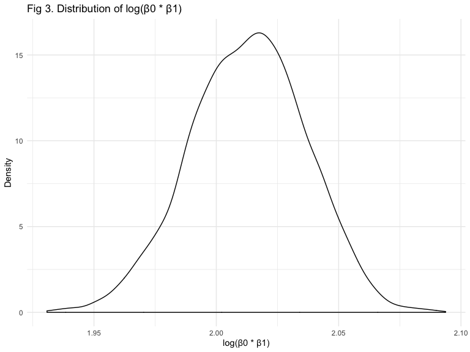
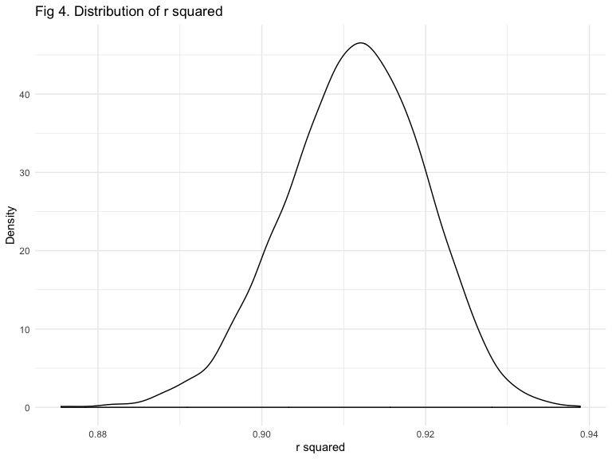

Homework 6
================
Cui Sitong (sc4636)
11/19/2019

## Problem 1

``` r
bwt = read_csv("./data/birthweight.csv") %>%
  drop_na() %>% 
  mutate_at(c("babysex", "frace", "malform", "mrace"), as.factor) %>% 
  select(bwt, everything())
```

The data contained 4342 observations over 20 variables including baby’s
birth weight and 19 other possible predictors.

``` r
lin_reg_1 = lm(bwt ~ babysex + mrace + gaweeks + momage + smoken + wtgain, data = bwt)

bwt = bwt %>% 
  add_predictions(lin_reg_1) %>% 
  add_residuals(lin_reg_1)

bwt %>% 
  ggplot(aes(x = pred, y = resid)) +
  geom_point(alpha = .8, size = .5) +
  labs(
    title = "Fig 1. Residuals vs Fitted",
    x = "Fitted values",
    y = "Residuals"
  )
```


Model 1 is proposed in interest of exploring the relationship between
mother’s status and their baby’s birth weight. Important predictors
include mother’s race, age, smoking status and weight gain during
pregnancy. In addition, baby’s gender and gestational age are included
in the model since they are important confounders given previous
studies. Other factors related to mother’s status such as mother’s
height, menarch age and BMI are excluded since they are unlikely to be
relevant. Also, mother’s weight before pregnancy and at delivery are not
considered since weight gain concludes the difference between them. In
conclusion, 6 predictors are used in model 1 to predict baby’s
birthweight.

``` r
set.seed(37)
cv_bwt = crossv_mc(bwt, nrow(bwt))

cv_bwt = 
  cv_bwt %>% 
  mutate(lin_reg_1  = map(train, ~lm(bwt ~ babysex + mrace + gaweeks + momage + smoken + wtgain, data = .x)),
         lin_reg_2  = map(train, ~lm(bwt ~ blength + gaweeks, data = .x)),
         lin_reg_3  = map(train, ~lm(bwt ~ bhead * blength * babysex, data = .x))) %>% 
  mutate(rmse_1 = map2_dbl(lin_reg_1, test, ~rmse(model = .x, data = .y)),
         rmse_2 = map2_dbl(lin_reg_2, test, ~rmse(model = .x, data = .y)),
         rmse_3 = map2_dbl(lin_reg_3, test, ~rmse(model = .x, data = .y)))

cv_bwt %>% 
  select(starts_with("rmse")) %>% 
  pivot_longer(
    everything(),
    names_to = "model", 
    values_to = "rmse",
    names_prefix = "rmse_") %>% 
  mutate(model = fct_inorder(model)) %>% 
  ggplot(aes(x = model, y = rmse, color = model)) + 
  geom_violin(alpha = .6) +
  labs(
    title = "Fig 2. RSME in three models"
  ) +
  theme(legend.position = "none")
```


Among the three models, the last one has least RSME which means that
model 3 gives relatively better prediction compared to model 1 and 2.
This is reasonable as baby’s head circumference and length indicate size
of the baby which is highly associated with weight.

## Problem 2

``` r
weather_df = 
  rnoaa::meteo_pull_monitors(
    c("USW00094728"),
    var = c("PRCP", "TMIN", "TMAX"), 
    date_min = "2017-01-01",
    date_max = "2017-12-31") %>%
  mutate(
    name = recode(id, USW00094728 = "CentralPark_NY"),
    tmin = tmin / 10,
    tmax = tmax / 10) %>%
  select(name, id, everything())
```

    ## Registered S3 method overwritten by 'crul':
    ##   method                 from
    ##   as.character.form_file httr

    ## Registered S3 method overwritten by 'hoardr':
    ##   method           from
    ##   print.cache_info httr

    ## file path:          /Users/Ulga/Library/Caches/rnoaa/ghcnd/USW00094728.dly

    ## file last updated:  2019-09-26 10:25:36

    ## file min/max dates: 1869-01-01 / 2019-09-30

``` r
set.seed(37)
boot = weather_df %>% 
  bootstrap(n = 5000) %>% 
  mutate(
    lin_reg = map(strap, ~lm(tmax ~ tmin, data = .x)),
    results = map(lin_reg, broom::tidy),
    r_sq = map(lin_reg, broom::glance)) %>% 
  select(-strap, -lin_reg) %>% 
  unnest(results, r_sq) %>% 
  select(.id, term, estimate, r.squared) %>% 
  mutate(term = recode(term, 
                       "(Intercept)" = "beta_0_hat",
                       "tmin" = "beta_1_hat")) %>% 
  pivot_wider(names_from = term, values_from = estimate) %>% 
  mutate(log = log(beta_0_hat * beta_1_hat))

boot %>% ggplot(aes(x = log)) + 
  geom_density() +
  labs(
    title = "Fig 3. Distribution of log(β0 * β1)",
    x = "log(β0 * β1)",
    y = "Density"
  )
```



``` r
boot %>% ggplot(aes(x = r.squared)) + 
  geom_density() +
  labs(
    title = "Fig 4. Distribution of r squared",
    x = "r squared",
    y = "Density"
  )
```



According to figure 3 and 4, both log(β0 \* β1) and r squared are likely
to be normally distributed. Sampling distribution of log(β0 \* β1) has a
mean of 2.0130305 and standard deviation of 0.0237915. Sampling
distribution of r squared has a mean of 0.9113032 and standard deviation
of 0.0085833.

``` r
boot %>% summarize(
  r_sq_025 = quantile(r.squared, .025),
  r_sq_975 = quantile(r.squared, .975),
  log_025 = quantile(log, .025),
  log_975 = quantile(log, .975)
)
```

    ## # A tibble: 1 x 4
    ##   r_sq_025 r_sq_975 log_025 log_975
    ##      <dbl>    <dbl>   <dbl>   <dbl>
    ## 1    0.894    0.927    1.97    2.06

  - 95% confidence interval for r square is 0.8935637 - 0.9270317.

  - 95% confidence interval for log(β0 \* β1) is 1.9653407 - 2.0575089.
